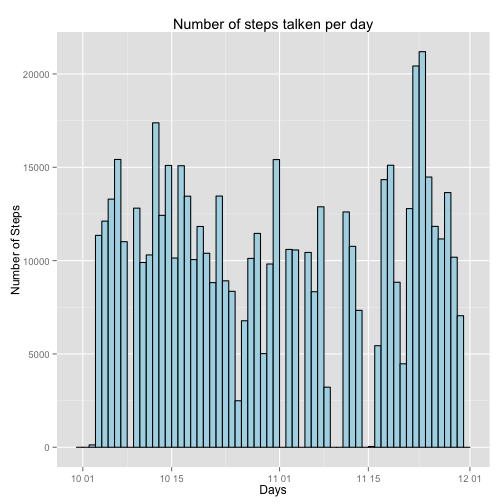
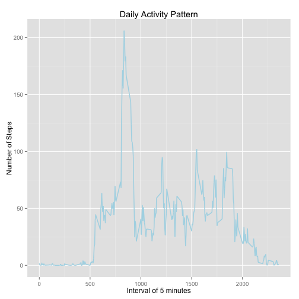
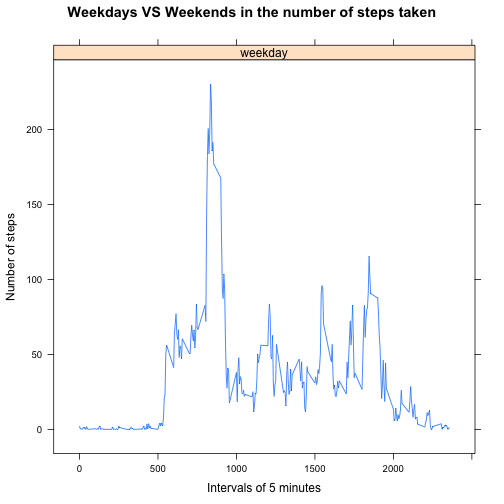
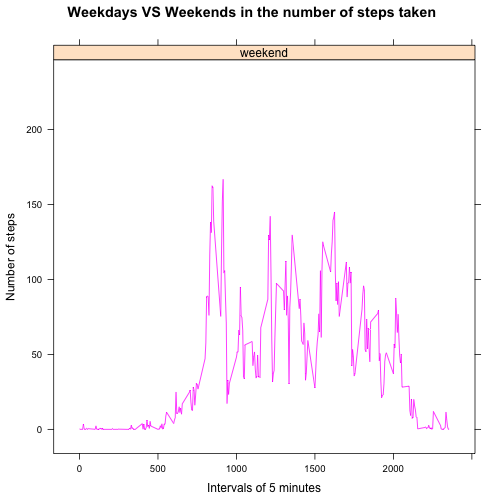

# Reproducible Research: Peer Assessment 1


## Loading and preprocessing the data
Load Required librarys:
* ggplot2
* lattice


Quick summary of Data:

```r
activity <- read.csv("activity.csv")
activity$date <- as.Date(activity$date)
summary(activity)
```

```
##      steps            date               interval   
##  Min.   :  0.0   Min.   :2012-10-01   Min.   :   0  
##  1st Qu.:  0.0   1st Qu.:2012-10-16   1st Qu.: 589  
##  Median :  0.0   Median :2012-10-31   Median :1178  
##  Mean   : 37.4   Mean   :2012-10-31   Mean   :1178  
##  3rd Qu.: 12.0   3rd Qu.:2012-11-15   3rd Qu.:1766  
##  Max.   :806.0   Max.   :2012-11-30   Max.   :2355  
##  NA's   :2304
```


## What is mean total number of steps taken per day?

Make a histogram of the total number of steps taken each day
- To calculate the mean of the total number of steps takne each day, it is necessary to ignore the missing values (NA) on the column steps.
- Graphic representation:

```r
qplot(date,
      data = activity,
      weight=activity$steps,
      main="Number of steps talken per day",
      xlab="Days",
      ylab="Number of Steps",
      binwidth=1,
      col=I("black"),
      fill=I("lightblue")
      )
```

 
Calculate and report the **mean** and **median** total number of steps takne per day:


```r
mean_steps <- mean(tapply(activity$steps,activity$date, sum, na.rm=TRUE))
median_steps <- median(tapply(activity$steps,activity$date, sum, na.rm=TRUE))
```
- Mean steps: 9354.2295
- Median steps: 10395


## What is the average daily activity pattern?

Make a time series plot (i.e. type = "l") of 5-minute interval (x-axis) and the average number of steps taken, averaged across all days (y-axis).

- Graphic representation:


```r
avg_steps <- data.frame(cbind(activity$interval,
                         tapply(activity$steps, activity$interval,mean,na.rm=TRUE)
                         ))
colnames(avg_steps) <- c("interval","steps")
ggplot(data = avg_steps,
       aes(x=interval,y=steps)) +
         geom_line(color="lightblue",size=0.7) +
         ggtitle("Daily Activity Pattern") +
         xlab("Interval of 5 minutes") +
         ylab("Number of Steps")
```

 

Which 5-minute interval, on average across all the days in the dateset, contains the maxinum number of steps?

```r
max_steps_interval <- avg_steps[which.max(avg_steps$steps),"interval"]
min_steps_interval <- avg_steps[which.min(avg_steps$steps),"interval"]

paste("Max steps interval:",max_steps_interval,"(UTC Time:",invl2Hour(max_steps_interval),")")
```

```
## [1] "Max steps interval: 835 (UTC Time: 13:55 )"
```

```r
paste("Min steps interval:",min_steps_interval,"(UTC Time:",invl2Hour(min_steps_interval),")")
```

```
## [1] "Min steps interval: 40 (UTC Time: 00:40 )"
```


## Imputing missing values

Note that there are a number of days/intervals where there are missing values. The presence of missing days may introduce bias into some calculations or summaries of the data. Caclulate and report the total number of missing values in the dateset.


```r
sum(is.na(activity$steps))
```

```
## [1] 2304
```

Devise a strategy for filling in all of the missing values in the dateset.
The stragety does not need to be sophisticated. For example, you cound use the mean/median for that day, or the mean for that 5-minute interval.
And create a new dateset that equal to the original dateset but with the missing data filled in.
- The strategy is to replace NA with 5-minute interval mean


```r
strategy<- activity
strategy[is.na(strategy[,1]),1] <- avg_steps[is.na(strategy[,1]),2]
```

Make a histogram of the total number of steps taken each day an Cacluate and report the mean and median total number of steps taken per day.


```r
qplot(date,
      date=strategy,
      weight=strategy$steps,
      main="Number of steps taken per day (Non NA)",
      xlab="Days",
      ylab="Number of Steps",
      binwidth=1,
      color=I("black"),
      fill=I("blue"))
```

```
## Don't know how to automatically pick scale for object of type function. Defaulting to continuous
```

```
## Error: arguments imply differing number of rows: 17568, 0, 1
```


```r
mean_steps_strategy <- mean(tapply(strategy$steps,strategy$date, sum, na.rm=TRUE))
median_steps_strategy <- median(tapply(strategy$steps,strategy$date, sum, na.rm=TRUE))
```
- Mean steps: 1.0766 &times; 10<sup>4</sup>
- Median steps: 1.0766 &times; 10<sup>4</sup>


## Are there differences in activity patterns between weekdays and weekends?
1. Create a new factor variable in the dataset with two levels – “weekday” and “weekend” indicating whether a given date is a weekday or weekend day.

```r
strategy$type_of_day<-as.factor(
  ifelse(
    span2EngWeekday(strategy$date) %in%
      c("Saturday","Sunday"),
    "weekend",
    "weekday"))
```

Make a panel plot containing a time series plot (i.e. type = "l") of the 5-minute interval (x-axis) and the average number of steps taken, averaged across all weekday days or weekend days (y-axis). The plot should look something like the following, which was creating using simulated data:


```r
xyplot(steps ~ interval | type_of_day,
       aggregate(steps ~ interval + type_of_day,
                 strategy,
                 FUN = mean),
       layout = c(1, 1),
       type = "l",
       main = "Weekdays VS Weekends in the number of steps taken",
       xlab = "Intervals of 5 minutes",
       ylab = "Number of steps",
       group = type_of_day)
```

  


